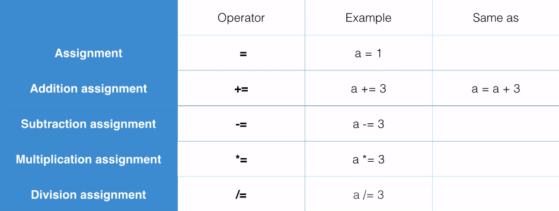
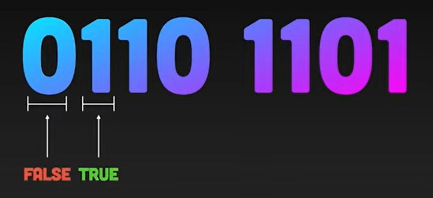
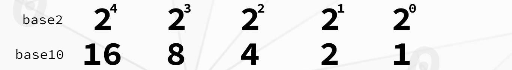

# C# Basics for Beginners

C# is a powerful Object Orientated language. This documentation serves as an entry point into the world of C# programming.

- [C# Basics for Beginners](#c-basics-for-beginners)
  - [Primitive Types](#primitive-types)
    - [Integer Numeric Types](#integer-numeric-types)
    - [Floating-Point Numeric Types](#floating-point-numeric-types)
    - [Other Primitive Types](#other-primitive-types)
  - [Variables and Constants](#variables-and-constants)
    - [Declaring and Initializing Variables](#declaring-and-initializing-variables)
    - [Declaring and Initializing Constants](#declaring-and-initializing-constants)
  - [Operators in C#](#operators-in-c)
    - [Arithmetic Operators](#arithmetic-operators)
    - [Comparison Operators](#comparison-operators)
    - [Assignment Operators](#assignment-operators)
    - [Boolean logical Operators](#boolean-logical-operators)
    - [Increment and Decrement Operators](#increment-and-decrement-operators)
    - [Bitwise and shift Operators](#bitwise-and-shift-operators)
      - [Why use Bitwise Operators?](#why-use-bitwise-operators)
      - [Why use a Byte?](#why-use-a-byte)
      - [Why use the Binary System?](#why-use-the-binary-system)
        - [Binary Representation](#binary-representation)
      - [Bitwise Operations Example](#bitwise-operations-example)
  - [Control Flow and Conditional Structures](#control-flow-and-conditional-structures)
    - [If-else](#if-else)
    - [Switch-case](#switch-case)
    - [Ternary operator](#ternary-operator)
  - [Loops](#loops)
    - [For Loop](#for-loop)
    - [While Loop](#while-loop)
    - [Do-While Loop](#do-while-loop)
  - [Type Conversions](#type-conversions)
    - [Implicit Conversion](#implicit-conversion)
    - [Explicit Conversion (Casting)](#explicit-conversion-casting)
  - [Non-Primitive Types](#non-primitive-types)
    - [Arrays](#arrays)
    - [Strings](#strings)
    - [Enumerations:](#enumerations)
    - [Classes](#classes)
    - [Structs](#structs)
  - [Input and Output Operations in C#](#input-and-output-operations-in-c)
    - [File Operations:](#file-operations)
    - [Directory Operations:](#directory-operations)
    - [Path Operations:](#path-operations)
    - [Stream-based Operations:](#stream-based-operations)
  - [Other Functionalities](#other-functionalities)
    - [DateTime and TimeSpan](#datetime-and-timespan)
    - [StringBuilder](#stringbuilder)
  - [Resumen y Conclusiones](#resumen-y-conclusiones)


## Primitive Types
Primitive types in C# are the basic building blocks for constructing more complex data structures. They include:

### Integer Numeric Types
- **int**: Represents signed integers.
  ```c#
  int number = 10;
  ```
  
- **long**: Represents signed long integers.

  ```c#
  long bigNumber = 10000000000L;
  ```

- **short**: Represents signed short integers.
    ```c#
    short smallNumber = 100;
    ```
  
- **byte**: Represents unsigned integers of 8 bits.
    ```c#
    byte smallPositiveNumber = 200;
    ```

- **sbyte**: Represents signed integers of 8 bits.
    ```c#
    sbyte smallNumber = -100;
    ```

- **uint**: Represents unsigned integers.
    ```c#
    uint positiveNumber = 2000U;
    ```

- **ulong**: Represents unsigned long integers.
    ```c#
    ulong bigPositiveNumber = 10000000000UL;
    ```

- **ushort**: Represents unsigned short integers.
    ```c#
    ushort smallPositiveNumber = 30000;
    ```

### Floating-Point Numeric Types
- **float**: Represents single-precision floating-point numbers.
    ```c#
    float floatValue = 3.14f;
    ```
- **double**: Represents double-precision floating-point numbers.
    ```c#
    double doubleValue = 3.141592653589793;
    ```
- **decimal**: Represents decimal numbers of high precision.
    ```c#
    decimal decimalValue = 123.456m;
    ```

### Other Primitive Types
- **char**: Represents a single Unicode character.
    ```c#
    char character = 'A';
    ```
- **bool**: Represents a Boolean value (true or false).
  
    ```c#
     bool isTrue = true;
    ```

## Variables and Constants

Variables and constants are similar; they are named storage locations that hold data. However, the values of variables can change during the execution of a program, whereas the values of constants cannot be changed after they are initialized. Both variables and constants must be declared with a specific type before they can be used.

### Declaring and Initializing Variables

In C#, declaring a variable is all about specifying the name of the variable you want to create. The basic syntax for declaring a variable is as follows:

```c#
// dataType variableName = value;
```

Where:

- **Datatype**: This is the data type of the variable.
- **VariableName**: This is the name of the variable you want to initialize.
- **Value**: This is the value you want to assign to the variable.

For example, if you want to declare and initialize an age variable of type int with the value 25, you can do it as follows:

```c#
int age; // Declaration of an integer variable
age = 25; // Assignment of a value to the variable
```

### Declaring and Initializing Constants

In C#, constants are different from variables in that they are declared using the keyword `const`. The basic syntax for declaring a constant is as follows:

```c#
// const  dataType variableName = value;
```

Where:

- **const**: This is the key word for declaring a constant.
- **Datatype**: This is the data type of the variable.
- **VariableName**: This is the name of the variable you want to initialize.
- **Value**: This is the value you want to assign to the variable.

Unlike variables, ***the values of constants cannot be changed after they are initialized.*** Both variables and constants must be declared with a specific type before they can be used.

For example, if you want to declare and initialize a PI constant of type double with the value of pi (approximately 3.14159), you can do so as follows:

```c#
const double PI = 3.14159;
```

## Operators in C#
C# provides a variety of operators, many of which are supported by the built-in types, enabling you to perform fundamental operations with values of those types. Those operators include the following groups:

- **Arithmetic operators** that perform arithmetic operations with numeric operands.
- **Comparison operators** that compare numeric operands.
- **Assignament operators** assign values to variables.
- **Boolean logical operators** that perform logical operations with bool operands.
- **Increment and Decrement operators** modify the value of a variable by one.
- **Bitwise and shift operators** that perform bitwise or shift operations with operands of the integral types.

  
### Arithmetic Operators
These operators are used to perform basic mathematical operations, such as addition, subtraction, multiplication, division, and modulus.


```c#
int a = 10;
int b = 5;
int add = a + b;		   //add = 15
int subtract = a - b;      //subtract = 5
int multiply = a * b;      //multiply = 50
int divide = a / b;        //divide = 2
int remainder = a % b;     //remainder = 0
```

### Comparison Operators
These operators are used to compare values and return a Boolean value (true or false).


```c#
int a = 10;
int b = 5;
bool equal = (a == b);        //equal = false
bool notEqual = (a != b);     //notEqual = true
bool greaterThan = (a > b);   //greaterThan = true
bool lessThan = (a < b);      //lessThan = false
```

### Assignment Operators
These operators are used to assign values to variables.



```c#
int x = 10;
x += 5;   // x is now 15 (equivalent to x = x + 5)
x -= 3;   // x is now 12 (equivalent to x = x - 3)
x *= 2;   // x is now 24 (equivalent to x = x * 2)
x /= 4;   // x is now 6  (equivalent to x = x / 4)
x %= 5;   // x is now 1  (equivalent to x = x % 5)
```

### Boolean logical Operators
These operators are used to combine logical expressions and return a Boolean value.


```c#
bool c1 = true;
bool c2 = false;
bool resultAnd = c1 && c2;   // resultAnd = false
bool resultOr = c1 || c2;    // resultOr = true
bool resultNot = !c1;        // resultNot = false
```

### Increment and Decrement Operators
These operators are used to increase or decrease the value of a variable by one unit.


```c#
int x = 10;
x++;  // Increment: x is now 11
x--;  // Decrement: x is now 10 again
```

### Bitwise and shift Operators
These operators are used to perform operations at ***the bit level*** on ***binary representations*** of data.

#### Why use Bitwise Operators?
Bitwise operations were more prevalent in the past when computers had limited memory compared to contemporary systems.

If you're working on embedded devices with memory limitations, bitwise operations remain highly relevant and valuable. It's essential to have a good understanding of them in such contexts.

#### Why use a Byte?
The smallest unit of addressable space that a CPU can reference is typically one byte. This means that the smallest amount of space a variable can occupy in memory is one byte.


#### Why use the Binary System?
"Binary" is a numeral system that uses a base of 2. In the binary system, each digit or bit can have one of two possible values: 0 or 1. This contrasts with the decimal system (base-10), which we commonly use, where each digit can have one of ten possible values (0 through 9).



In computing, binary is fundamental because computers use binary digits (bits) to represent and manipulate data internally. Everything in a computer is ultimately represented using binary, including numbers, text, images, and instructions. 

***Understanding binary is essential for understanding how computers store and process information at the lowest level.***

##### Binary Representation
Binary representation is used to represent numbers in base-2 format using only 0s and 1s. When we talk about a byte, we're referring to a group of 8 bits. Each bit in a byte can be either 0 or 1, which aligns perfectly with binary representation. 

***numeral system with a base of 2.***


For example, let's convert the decimal number 13 into binary:

To do this, we can repeatedly divide 13 by 2, keeping track of the remainders. Here's the process:
```c#
13 ÷ 2 = 6    //remainder 1
6 ÷ 2 = 3     //remainder 0
3 ÷ 2 = 1     //remainder 1
1 ÷ 2 = 0     //remainder 1
```
Reading the remainders from bottom to top, **we get 1101**. So, the binary representation of the decimal number 13 is 1101 in base-2.

Now backwards, let's convert the binary 1101 into a decimal number:

To convert binary to decimal, we multiply each bit by 2 raised to its respective power and sum the results. 




```c#
1 * 2^0 = 1
0 * 2^1 = 0
1 * 2^2 = 4
1 * 2^3 = 8
```
Adding these together:

So, the binary number 1101 is equal to the decimal number 13.

#### Bitwise Operations Example


```c#
int a = 5;     // binary representation: 00000101
int b = 3;     // binary representation: 00000011

//AND: Compares bits from two numbers. If both bits at the same position are 1, the resulting bit is 1.
int resultAnd = a & b;    // Bitwise AND: 00000001 (1)

//OR: Compares bits from two numbers. If at least one bit at the same position is 1, the resulting bit is 1.
int resultOr = a | b;     // Bitwise OR: 00000111 (7)

//XOR: Compares bits from two numbers. If the bits at the same position are different, the resulting bit is 1.
int resultXor = a ^ b;    // Bitwise XOR: 00000110 (6)

//NOT: Inverts each bit in a number. 0s become 1s and 1s become 0s.
int resultNot = ~a;       // Bitwise NOT: 11111010 (-6)

//LEFT SHIFT: Shifts all bits of a number to the left, introducing zeros on the right side.
int resultShiftLeft = a << 1;  // Left Shift: 00001010 (10)

//RIGHT SHIFT: Shifts all bits of a number to the right, introducing zeros on the left side.
int resultShiftRight = a >> 1; // Right Shift: 00000010 (2)

```
## Control Flow and Conditional Structures

Control flow refers to the order in which the individual statements, instructions, or function calls of a program are executed. Conditional structures are programming constructs that allow decisions to be made within the code based on certain conditions. These conditions determine which block of code will be executed next.

**Conditional Structures:**

### If-else 
   The if-else statement is used to execute a block of code if a specified condition is true, and another block of code if the condition is false.

   ```c#
   int age = 18;
   if (age >= 18)
   {
       Console.WriteLine("You are an adult.");
   }
   else
   {
       Console.WriteLine("You are a minor.");
   }
   ```

### Switch-case
   The switch-case statement provides a way to execute different blocks of code based on the value of an expression or variable.

   ```c#
   char operation = '*';
   double num1 = 10;
   double num2 = 5;
   double result = 0;
   
   switch (operation)
   {
       case '+':
           result = num1 + num2;
           break;
       case '-':
           result = num1 - num2;
           break;
       case '*':
           result = num1 * num2;
           break;
       case '/':
           result = num1 / num2;
           break;
       default:
           Console.WriteLine("Invalid operation.");
           break;
   }
   
   Console.WriteLine("The result is: " + result);
   ```
### Ternary operator
   The ternary operator is a shorthand version of an if-else statement and is used to assign a value to a variable based on a condition.

   ```c#
   int number = 10;
   string message = (number % 2 == 0) ? "It's even" : "It's odd";
   Console.WriteLine(message);
   ```

These conditional structures are essential for creating flexible and dynamic programs that can adapt their behavior based on different inputs or circumstances. They are fundamental tools for controlling the flow of execution in a program and implementing various decision-making logic.

## Loops
In C#, loops are used to repeat a block of code multiple times, enabling efficient handling of repetitive tasks and processing of data collections. They allow for precise control over program flow and are essential for implementing algorithms and automating tasks efficiently.

### For Loop
The for loop is used to execute a block of code a specified number of times.
   - **Structure**: 
     ```csharp
     for (initialization; condition; iteration)
     {
         // code to be executed
     }
     ```
   - **Functionality**: 
     - Initialization: Executes once at the beginning of the loop.
     - Condition: Checked before each iteration. If true, the loop continues; otherwise, it exits.
     - Iteration: Executes after each iteration of the loop.
   - **Example**:
     ```csharp
     for (int i = 0; i < 5; i++)
     {
         Console.WriteLine(i);
     }
     ```
   - **Common Use**: *Iterating over arrays, collections, or a range of values.*

### While Loop
The while loop executes a block of code as long as a specified condition is true.
   - **Structure**: 
     ```csharp
     while (condition)
     {
         // code to be executed
     }
     ```
   - **Functionality**: 
     - The condition is checked before each iteration. If true, the loop continues; otherwise, it exits.
   - **Example**:
     ```csharp
     int num = 0;
     while (num < 5)
     {
         Console.WriteLine(num);
         num++;
     }
     ```
   - **Common Use**: *Executing code based on a condition that may change during execution.*

### Do-While Loop
  The do-while loop is similar to a while loop, but it guarantees that the code inside the loop is executed at least once before the condition is checked.
  - **Structure**: 
     ```csharp
     do
     {
         // code to be executed
     } while (condition);
     ```
   - **Functionality**: 
    The code inside the loop is executed once before checking the condition. If true, the loop continues; otherwise, it exits.
    **Example**:

     ```c#
     int num = 0;
     do
     {
         Console.WriteLine(num);
         num++;
     } while (num < 5);
     ```
   - **Common Use**: *Ensuring a block of code is executed at least once, regardless of the condition.*

## Type Conversions
Type conversions in C# refer to the process of converting a value from one data type to another. There are two main types of conversions: implicit conversions and explicit conversions (casting).

### Implicit Conversion
Implicit conversion occurs automatically when there is no risk of data loss during the conversion. It's performed by the compiler without requiring any additional syntax. This type of conversion is typically used when converting smaller data types to larger ones.

```c#
int numInt = 10;
double numDouble = numInt; // Implicit conversion from int to double
```

**Use Case:**
Implicit conversions are commonly used when assigning a value of a smaller data type to a larger data type, such as converting an integer to a floating-point number.

### Explicit Conversion (Casting)
Explicit conversion, also known as casting, is a manual conversion process where the programmer explicitly specifies the desired target data type. This type of conversion is necessary when there's a risk of data loss or when converting from a larger data type to a smaller one.

```c#
double numDouble = 10.5;
int numInt = (int)numDouble; // Explicit conversion (casting) from double to int
```
**Use Case:**
Explicit conversions are used when converting from a larger data type to a smaller one, such as converting a floating-point number to an integer. It's also used when converting between data types that aren't implicitly convertible, such as converting between numerical and non-numerical types.

## Non-Primitive Types
Non-primitive types in C# are data types that are composed of primitive types or other non-primitive types. They include: 
- Arrays
- Strings
- Enumerations
- Classes
- Structs

### Arrays
Arrays are data structures that store a fixed-size sequential collection of elements of the same type.

```c#
int[] numbers = new int[5]; // Declaration and instantiation of an integer array
numbers[0] = 1;
numbers[1] = 2;
// Accessing elements of the array
Console.WriteLine(numbers[0]); // Output: 1
Console.WriteLine(numbers[1]); // Output: 2

int[] numbers = new int[5] {1,2,3,4,5} //Declaration and initiation of the array
```
Some methods that are frequently used to manipulate arrays in C# offer functionality such as copying, searching, sorting, and modifying array elements.

1. **Length Property:**
   - **Description:** Gets the total number of elements in the array.
   - **Example:**
     ```csharp
     int[] numbers = { 1, 2, 3, 4, 5 };
     int length = numbers.Length; // length will be 5
     ```

2. **Copy Method:**
   - **Description:** Copies a range of elements from an array starting at the specified source index and pastes them to another array starting at the specified destination index.
   - **Example:**
     ```csharp
     int[] sourceArray = { 1, 2, 3 };
     int[] destinationArray = new int[3];
     Array.Copy(sourceArray, destinationArray, 3); // Copies all elements from sourceArray to destinationArray
     ```

3. **Clear Method:**
   - **Description:** Sets a range of elements in the array to zero, false, or null, depending on the element type.
   - **Example:**
     ```csharp
     int[] numbers = { 1, 2, 3, 4, 5 };
     Array.Clear(numbers, 0, numbers.Length); // Clears all elements in the numbers array
     ```

4. **IndexOf Method:**
   - **Description:** Searches for the specified object and returns the index of its first occurrence within the entire array.
   - **Example:**
     ```csharp
     int[] numbers = { 1, 2, 3, 4, 5 };
     int index = Array.IndexOf(numbers, 3); // index will be 2
     ```

5. **Reverse Method:**
   - **Description:** Reverses the sequence of elements in the entire array.
   - **Example:**
     ```csharp
     int[] numbers = { 1, 2, 3, 4, 5 };
     Array.Reverse(numbers); // numbers will be { 5, 4, 3, 2, 1 }
     ```

6. **Sort Method:**
   - **Description:** Sorts the elements in an entire array using the IComparable implementation of each element of the array.
   - **Example:**
     ```csharp
     int[] numbers = { 5, 3, 1, 4, 2 };
     Array.Sort(numbers); // numbers will be { 1, 2, 3, 4, 5 }
     ```

7. **Resize Method:**
   - **Description:** Changes the size of the array to a specified new size.
   - **Example:**
     ```csharp
     int[] numbers = { 1, 2, 3 };
     Array.Resize(ref numbers, 5); // Resizes the numbers array to have a length of 5
     ```

### Strings
Strings are sequences of characters used to represent text. In C#, strings are immutable, meaning their values cannot be changed after they are created.

```c#
string greeting = "Hello, world!"; // Declaration and initialization of a string
Console.WriteLine(greeting); // Output: Hello, world!
```
Some methods that are frequently used to manipulate strings in C# offer functionality such as extracting substrings, changing casing, searching for substrings, splitting strings into substrings, and replacing substrings.

1. **Length Property:**
   - **Description:** Gets the number of characters in the current string.
   - **Example:**
     ```csharp
     string str = "Hello, world!";
     int length = str.Length; // length will be 13
     ```

2. **Substring Method:**
   - **Description:** Retrieves a substring from this instance. The substring starts at a specified character position and has a specified length.
   - **Example:**
     ```csharp
     string str = "Hello, world!";
     string subStr = str.Substring(7, 5); // subStr will be "world"
     ```

3. **ToUpper Method:**
   - **Description:** Returns a copy of this string converted to uppercase.
   - **Example:**
     ```csharp
     string str = "hello";
     string upperStr = str.ToUpper(); // upperStr will be "HELLO"
     ```

4. **ToLower Method:**
   - **Description:** Returns a copy of this string converted to lowercase.
   - **Example:**
     ```csharp
     string str = "HELLO";
     string lowerStr = str.ToLower(); // lowerStr will be "hello"
     ```

5. **Contains Method:**
   - **Description:** Returns a value indicating whether a specified substring occurs within this string.
   - **Example:**
     ```csharp
     string str = "Hello, world!";
     bool contains = str.Contains("world"); // contains will be true
     ```

6. **Split Method:**
   - **Description:** Splits a string into substrings based on the characters in an array and returns an array of substrings.
   - **Example:**
     ```csharp
     string str = "apple,banana,orange";
     string[] fruits = str.Split(','); // fruits will be ["apple", "banana", "orange"]
     ```

7. **IndexOf Method:**
   - **Description:** Reports the zero-based index of the first occurrence of a specified string within this instance.
   - **Example:**
     ```csharp
     string str = "Hello, world!";
     int index = str.IndexOf("world"); // index will be 7
     ```

8. **Replace Method:**
   - **Description:** Returns a new string in which all occurrences of a specified substring in the current string are replaced with another specified substring.
   - **Example:**
     ```csharp
     string str = "Hello, world!";
     string newStr = str.Replace("world", "universe"); // newStr will be "Hello, universe!"
     ```

### Enumerations:
Enumerations, or enums, are special value types that allow you to define named constants with a specific underlying type. Enumerations provide a way to create sets of related named constants, making code more readable and maintainable.

```c#
enum DaysOfWeek
{
    Sunday,
    Monday,
    Tuesday,
    Wednesday,
    Thursday,
    Friday,
    Saturday
}

DaysOfWeek today = DaysOfWeek.Monday;
Console.WriteLine(today); // Output: Monday
```
Some methods of enums are frequently used to retrieve the name of a constant based on its value or to check if a given value or name exists in the enum.

1. **GetName Method:**
   - **Description:** Retrieves the name of the constant in the specified enumeration that has the specified value.
   - **Example:**
     ```csharp
     enum DaysOfWeek
     {
         Sunday,
         Monday,
         Tuesday,
         Wednesday,
         Thursday,
         Friday,
         Saturday
     }

     string day = Enum.GetName(typeof(DaysOfWeek), 1); // Returns "Monday"
     ```

2. **IsDefined Method:**
   - **Description:** Returns a Boolean indicating whether a given integral value, or its name as a string, exists in the specified enumeration.
   - **Example:**
     ```csharp
     enum DaysOfWeek
     {
         Sunday,
         Monday,
         Tuesday,
         Wednesday,
         Thursday,
         Friday,
         Saturday
     }

     bool isDefined = Enum.IsDefined(typeof(DaysOfWeek), "Monday"); // Returns true
     ```

### Classes
Classes are reference types that serve as blueprints for creating objects. They encapsulate data for the object and define methods for manipulating that data. Classes support inheritance, encapsulation, and polymorphism, allowing for the creation of complex data structures and behavior.

```c#
class Person
{
    public string Name { get; set; }
    public int Age { get; set; }

    public void PrintInfo()
    {
        Console.WriteLine($"Name: {Name}, Age: {Age}");
    }
}

Person person1 = new Person();
person1.Name = "John";
person1.Age = 30;
person1.PrintInfo(); // Output: Name: John, Age: 30
```
These methods are fundamental for defining the behavior and functionality of classes in C#. They allow for encapsulation, abstraction, and code reusability within the class.

1. **Constructor:**
   - **Description:** Initializes an instance of the class.
   - **Example:**
     ```csharp
     public class Person
     {
         public string Name { get; set; }
         public int Age { get; set; }

         // Constructor
         public Person(string name, int age)
         {
             Name = name;
             Age = age;
         }
     }

     Person person1 = new Person("John", 30);
     ```

2. **ToString Method:**
   - **Description:** Returns a string that represents the current object.
   - **Example:**
     ```csharp
     public class Person
     {
         public string Name { get; set; }
         public int Age { get; set; }

         public override string ToString()
         {
             return $"Name: {Name}, Age: {Age}";
         }
     }

     Person person1 = new Person("John", 30);
     string personInfo = person1.ToString(); // Returns "Name: John, Age: 30"
     ```

3. **Equals Method:**
   - **Description:** Determines whether the specified object is equal to the current object.
   - **Example:**
     ```csharp
     public class Person
     {
         public string Name { get; set; }
         public int Age { get; set; }

         public override bool Equals(object obj)
         {
             if (obj == null || GetType() != obj.GetType())
                 return false;

             Person otherPerson = (Person)obj;
             return Name == otherPerson.Name && Age == otherPerson.Age;
         }
     }

     Person person1 = new Person { Name = "John", Age = 30 };
     Person person2 = new Person { Name = "John", Age = 30 };
     bool isEqual = person1.Equals(person2); // Returns true
     ```

4. **GetHashCode Method:**
   - **Description:** Serves as the default hash function.
   - **Example:**
     ```csharp
     public class Person
     {
         public string Name { get; set; }
         public int Age { get; set; }

         public override int GetHashCode()
         {
             return Name.GetHashCode() ^ Age.GetHashCode();
         }
     }

     Person person = new Person { Name = "John", Age = 30 };
     int hashCode = person.GetHashCode(); // Returns a unique hash code
     ```

5. **Custom Methods:**
   - **Description:** Methods defined by the programmer to perform specific actions or calculations.
   - **Example:**
     ```csharp
     public class Calculator
     {
         public int Add(int a, int b)
         {
             return a + b;
         }

         public int Subtract(int a, int b)
         {
             return a - b;
         }
     }

     Calculator calc = new Calculator();
     int result = calc.Add(5, 3); // result will be 8
     ```

### Structs
Structs are similar to classes but are value types rather than reference types. They are typically used for small, lightweight objects that have a short lifetime and do not require inheritance or polymorphism.

```c#
struct Point
{
    public int X;
    public int Y;

    public Point(int x, int y)
    {
        X = x;
        Y = y;
    }
}

Point p1 = new Point(1, 2);
Console.WriteLine($"X: {p1.X}, Y: {p1.Y}"); // Output: X: 1, Y: 2
```
Srtucts can contain methods like: constructors, equality comparison methods, hash code generation methods, and custom methods as required by your application.

1. **Constructor:**
   - **Description:** Initializes an instance of the struct.
   - **Example:**
     ```csharp
     public struct Point
     {
         public int X { get; }
         public int Y { get; }

         // Constructor
         public Point(int x, int y)
         {
             X = x;
             Y = y;
         }
     }

     Point p = new Point(3, 4);
     ```

2. **Equals Method:**
   - **Description:** Determines whether the current object is equal to another object of the same type.
   - **Example:**
     ```csharp
     public struct Point
     {
         public int X { get; }
         public int Y { get; }

         public override bool Equals(object obj)
         {
             if (!(obj is Point))
                 return false;

             Point otherPoint = (Point)obj;
             return X == otherPoint.X && Y == otherPoint.Y;
         }
     }

     Point p1 = new Point(3, 4);
     Point p2 = new Point(3, 4);
     bool isEqual = p1.Equals(p2); // Returns true
     ```

3. **GetHashCode Method:**
   - **Description:** Serves as the default hash function.
   - **Example:**
     ```csharp
     public struct Point
     {
         public int X { get; }
         public int Y { get; }

         public override int GetHashCode()
         {
             return X.GetHashCode() ^ Y.GetHashCode();
         }
     }

     Point p = new Point(3, 4);
     int hashCode = p.GetHashCode(); // Returns a unique hash code
     ```

4. **ToString Method:**
   - **Description:** Returns a string that represents the current object.
   - **Example:**
     ```csharp
     public struct Point
     {
         public int X { get; }
         public int Y { get; }

         public override string ToString()
         {
             return $"({X}, {Y})";
         }
     }

     Point p = new Point(3, 4);
     string pointStr = p.ToString(); // Returns "(3, 4)"
     ```

5. **Custom Methods:**
   - **Description:** Methods defined by the programmer to perform specific actions or calculations.
   - **Example:**
     ```csharp
     public struct Rectangle
     {
         public int Width { get; }
         public int Height { get; }

         public Rectangle(int width, int height)
         {
             Width = width;
             Height = height;
         }

         public int CalculateArea()
         {
             return Width * Height;
         }
     }

     Rectangle rect = new Rectangle(5, 3);
     int area = rect.CalculateArea(); // area will be 15
     ```

## Input and Output Operations in C#
**System.IO Namespace**

In C#, the `System.IO` namespace provides classes for performing various I/O operations, including reading from and writing to files, working with directories, and more. Here are some commonly used classes and methods:

### File Operations:

- **File.Exists(string path):** Checks if a file exists at the specified path.
```c#
using System;
using System.IO;

class Program
{
    static void Main()
    {
        string filePath = "example.txt"; // Path to the file

        // Check if the file exists
        if (File.Exists(filePath))
        {
            Console.WriteLine("File exists.");
        }
        else
        {
            Console.WriteLine("File does not exist.");
        }
    }
}
```

- **File.Delete(string path):** Deletes the specified file.
```c#
using System;
using System.IO;

class Program
{
    static void Main()
    {
        string filePath = "example.txt"; // Path to the file to delete

        // Check if the file exists before deleting
        if (File.Exists(filePath))
        {
            // Delete the specified file
            File.Delete(filePath);
            Console.WriteLine("File deleted successfully.");
        }
        else
        {
            Console.WriteLine("File does not exist.");
        }
    }
}
```

- **File.Copy(string sourceFileName, string destFileName):** Copies a file from one location to another.
```c#
using System;
using System.IO;

class Program
{
    static void Main()
    {
        string sourceFile = "source.txt";
        string destFile = "destination.txt";

        File.Copy(sourceFile, destFile);

        Console.WriteLine("File copied successfully.");
    }
}
```

- **File.Move(string sourceFileName, string destFileName):** Moves a file from one location to another.
```c#
using System;
using System.IO;

class Program
{
    static void Main()
    {
        string sourceFile = "source.txt"; // Path to the source file
        string destFile = "destination.txt"; // Path to the destination file

        // Move the file from source to destination
        File.Move(sourceFile, destFile);

        Console.WriteLine("File moved successfully.");
    }
}
```

- **File.Open(string path, FileMode mode):** Opens a file in the specified mode (read, write, etc.).
```c#
using System;
using System.IO;

class Program
{
    static void Main()
    {
        string filePath = "example.txt"; // Path to the file

        try
        {
            // Open the file in read mode
            using (FileStream fs = File.Open(filePath, FileMode.Open))
            {
                Console.WriteLine("File opened successfully.");
                // Perform operations on the file
            }
        }
        catch (IOException e)
        {
            Console.WriteLine("Error opening the file: " + e.Message);
        }
    }
}
```

### Directory Operations:

- **Directory.GetDirectories(string path):** Retrieves an array of directory names from the specified path.
```c#
using System;
using System.IO;

class Program
{
    static void Main()
    {
        string directoryPath = @"C:\Users"; // Path to the directory

        try
        {
            // Retrieve an array of directory names from the specified path
            string[] directories = Directory.GetDirectories(directoryPath);

            // Display each directory name
            foreach (string directory in directories)
            {
                Console.WriteLine(directory);
            }
        }
        catch (IOException e)
        {
            Console.WriteLine("Error accessing directories: " + e.Message);
        }
    }
}

```
- **Directory.GetFiles(string path):** Retrieves an array of file names from the specified path.
```c#
using System;
using System.IO;

class Program
{
    static void Main()
    {
        string directoryPath = @"C:\Users"; // Path to the directory

        try
        {
            // Retrieve an array of file names from the specified path
            string[] files = Directory.GetFiles(directoryPath);

            // Display each file name
            foreach (string file in files)
            {
                Console.WriteLine(file);
            }
        }
        catch (IOException e)
        {
            Console.WriteLine("Error accessing files: " + e.Message);
        }
    }
}
```
- **Directory.CreateDirectory(string path):** Creates a new directory at the specified path.
```c#
using System;
using System.IO;

class Program
{
    static void Main()
    {
        string directoryPath = @"C:\Temp\NewDirectory"; // Path to the new directory

        try
        {
            // Create a new directory at the specified path
            Directory.CreateDirectory(directoryPath);

            Console.WriteLine("Directory created successfully.");
        }
        catch (IOException e)
        {
            Console.WriteLine("Error creating directory: " + e.Message);
        }
    }
}
```
- **Directory.Delete(string path):** Deletes the specified directory.
```c#
using System;
using System.IO;

class Program
{
    static void Main()
    {
        string directoryPath = @"C:\Temp\ToDelete"; // Path to the directory to delete

        try
        {
            // Delete the specified directory
            Directory.Delete(directoryPath);

            Console.WriteLine("Directory deleted successfully.");
        }
        catch (IOException e)
        {
            Console.WriteLine("Error deleting directory: " + e.Message);
        }
    }
}
```
- **Directory.Move(string sourceDirName, string destDirName):** Moves a directory from one location to another.
```c#
using System;
using System.IO;

class Program
{
    static void Main()
    {
        string sourceDir = @"C:\Temp\ToMove"; // Source directory
        string destDir = @"C:\Temp\Moved"; // Destination directory

        try
        {
            // Move the directory from source to destination
            Directory.Move(sourceDir, destDir);

            Console.WriteLine("Directory moved successfully.");
        }
        catch (IOException e)
        {
            Console.WriteLine("Error moving directory: " + e.Message);
        }
    }
}
```

### Path Operations:

- **Path.Combine(params string[] paths):** Combines strings into a path.
```c#
using System;
using System.IO;

class Program
{
    static void Main()
    {
        string basePath = @"C:\";
        string fileName = "example.txt";

        // Combine strings into a path
        string fullPath = Path.Combine(basePath, fileName);

        Console.WriteLine("Full Path: " + fullPath);
    }
}
```
- **Path.GetExtension(string path):** Retrieves the extension of the specified path.
```c#
using System;
using System.IO;

class Program
{
    static void Main()
    {
        string filePath = @"C:\Temp\example.txt";

        // Retrieve the extension of the specified path
        string extension = Path.GetExtension(filePath);

        Console.WriteLine("File Extension: " + extension);
    }
}
```
- **Path.GetFileName(string path):** Retrieves the file name and extension from the specified path.
```c#
using System;
using System.IO;

class Program
{
    static void Main()
    {
        string filePath = @"C:\Temp\example.txt";

        // Retrieve the file name and extension from the specified path
        string fileName = Path.GetFileName(filePath);

        Console.WriteLine("File Name: " + fileName);
    }
}
```
- **Path.GetDirectoryName(string path):** Retrieves the directory name from the specified path.
```c#
using System;
using System.IO;

class Program
{
    static void Main()
    {
        string filePath = @"C:\Temp\example.txt";

        // Retrieve the directory name from the specified path
        string directoryName = Path.GetDirectoryName(filePath);

        Console.WriteLine("Directory Name: " + directoryName);
    }
}
```

### Stream-based Operations:

- **StreamReader:** Reads characters from a stream.
```c#
using System;
using System.IO;

class Program
{
    static void Main()
    {
        string filePath = "example.txt"; // Path to the file to read

        try
        {
            // Open the file for reading using StreamReader
            using (StreamReader sr = new StreamReader(filePath))
            {
                // Read and display lines from the file until the end
                string line;
                while ((line = sr.ReadLine()) != null)
                {
                    Console.WriteLine(line); // Output each line to the console
                }
            }
        }
        catch (IOException e)
        {
            Console.WriteLine("Error reading the file: " + e.Message);
        }
    }
}
```
- **StreamWriter:** Writes characters to a stream.
```c#
using System;
using System.IO;

class Program
{
    static void Main()
    {
        string filePath = "example.txt"; // Path to the file to write

        try
        {
            // Open the file for writing using StreamWriter
            using (StreamWriter sw = new StreamWriter(filePath))
            {
                // Write some text to the file
                sw.WriteLine("Hello, world!"); // Write a line of text to the file
            }

            Console.WriteLine("Text written to the file successfully.");
        }
        catch (IOException e)
        {
            Console.WriteLine("Error writing to the file: " + e.Message);
        }
    }
}
```
- **FileStream:** Provides a stream for a file.
```c#
using System;
using System.IO;

class Program
{
    static void Main()
    {
        string filePath = "example.txt"; // Path to the file

        try
        {
            // Open the file for reading and writing using FileStream
            using (FileStream fs = new FileStream(filePath, FileMode.OpenOrCreate, FileAccess.ReadWrite))
            {
                // Perform operations on the file stream
                // For example, you can read or write bytes directly to the stream
                byte[] buffer = new byte[1024]; // Buffer to hold data read from the file
                int bytesRead = fs.Read(buffer, 0, buffer.Length); // Read bytes from the file
                // Process the bytes read, if needed
                // Similarly, you can write data to the file using fs.Write()
            }

            Console.WriteLine("File stream operation completed successfully.");
        }
        catch (IOException e)
        {
            Console.WriteLine("Error working with file stream: " + e.Message);
        }
    }
}
```
## Other Functionalities
### DateTime and TimeSpan
DateTime is a struct in C# that represents a specific point in time, including both date and time components. It's commonly used for tasks involving date and time calculations, such as scheduling, time tracking, and event handling. TimeSpan, also a struct, represents a duration of time, such as a number of days, hours, minutes, etc.
```c#
using System;

class Program
{
    static void Main()
    {
        // DateTime methods and properties

        DateTime now = DateTime.Now; // Get current date and time
        DateTime futureDate = DateTime.Now.AddHours(1); // Add 1 hour to current time
        DateTime pastDate = DateTime.Now.Subtract(TimeSpan.FromDays(7)); // Subtract 7 days from current date
        string dateString = DateTime.Now.ToString("yyyy-MM-dd HH:mm:ss"); // Format current date and time as string
        int comparisonResult = DateTime.Now.CompareTo(futureDate); // Compare current date and future date

        // DateTime properties

        DateTime currentDate = DateTime.Now.Date; // Get current date without time component
        DayOfWeek day = DateTime.Now.DayOfWeek; // Get current day of the week
        int dayOfYear = DateTime.Now.DayOfYear; // Get current day of the year
        long ticks = DateTime.Now.Ticks; // Get ticks representing current date and time

        // TimeSpan methods and properties

        TimeSpan futureTime = TimeSpan.FromHours(1).Add(TimeSpan.FromMinutes(30)); // Add 1 hour and 30 minutes to TimeSpan
        TimeSpan remainingTime = TimeSpan.FromHours(3).Subtract(TimeSpan.FromMinutes(45)); // Subtract 45 minutes from 3 hours
        TimeSpan positiveTime = TimeSpan.FromMinutes(-15).Duration; // Get absolute value of TimeSpan
        int days = TimeSpan.FromDays(5).Days; // Get days component of TimeSpan
        int hours = TimeSpan.FromHours(2).Hours; // Get hours component of TimeSpan
        int minutes = TimeSpan.FromMinutes(30).Minutes; // Get minutes component of TimeSpan
        int seconds = TimeSpan.FromSeconds(45).Seconds; // Get seconds component of TimeSpan

        // Output results

        Console.WriteLine("Current Date and Time: " + now);
        Console.WriteLine("Future Date: " + futureDate);
        Console.WriteLine("Past Date: " + pastDate);
        Console.WriteLine("Formatted Date String: " + dateString);
        Console.WriteLine("Comparison Result: " + comparisonResult);

        Console.WriteLine("Current Date: " + currentDate);
        Console.WriteLine("Day of the Week: " + day);
        Console.WriteLine("Day of the Year: " + dayOfYear);
        Console.WriteLine("Ticks: " + ticks);

        Console.WriteLine("Future Time: " + futureTime);
        Console.WriteLine("Remaining Time: " + remainingTime);
        Console.WriteLine("Positive Time: " + positiveTime);
        Console.WriteLine("Days: " + days);
        Console.WriteLine("Hours: " + hours);
        Console.WriteLine("Minutes: " + minutes);
        Console.WriteLine("Seconds: " + seconds);
    }
}
```
### StringBuilder
StringBuilder is a class in C# that provides an efficient way to manipulate strings, especially when dealing with multiple string concatenations. Unlike the String class, which creates a new string object each time you modify it, StringBuilder allows you to modify a single string buffer without creating new objects, leading to better performance, especially for large strings or many concatenations.
```c#
using System;
using System.Text;

class Program
{
    static void Main()
    {
        // StringBuilder methods and properties
        StringBuilder sb = new StringBuilder(); // Create a new StringBuilder instance

        sb.Append("Hello"); // Append "Hello" to the StringBuilder
        sb.Append(" "); // Append a space
        sb.Append("World"); // Append "World"

        string result = sb.ToString(); // Convert StringBuilder to string

        // Output result
        Console.WriteLine("Result: " + result);
    }
}
```
## Resumen y Conclusiones
This documentation provides a condensed overview of fundamental C# concepts for beginners. It covers primitive types, variables, operators, control flow structures, loops, type conversions, non-primitive types, input/output operations, and handling dates and times. By understanding these concepts, beginners gain a solid understanding of C# programming essentials, enabling them to write basic programs and build a foundation for further learning and exploration in the language.